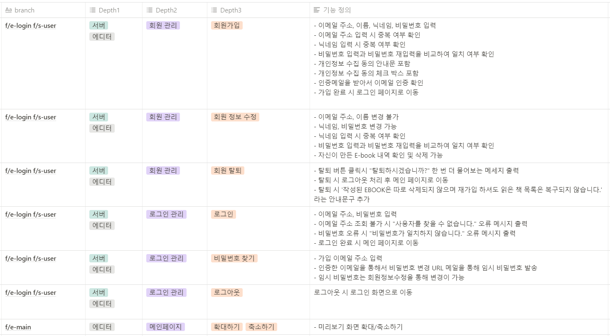
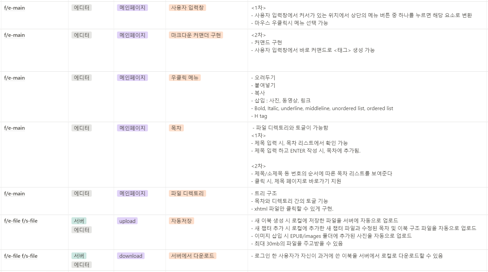
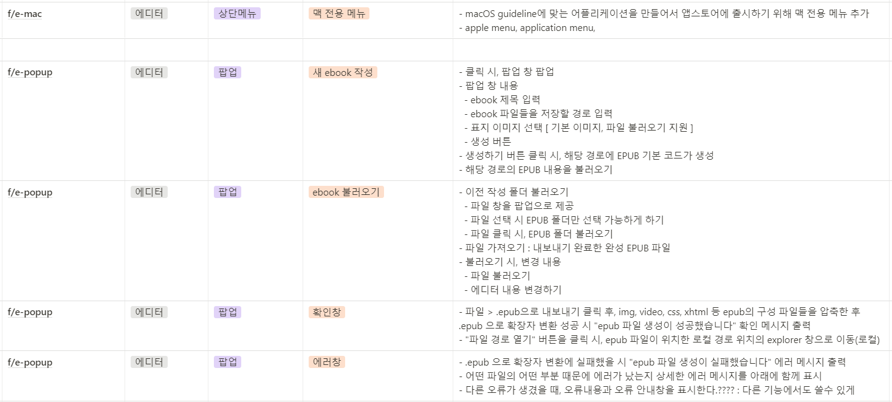
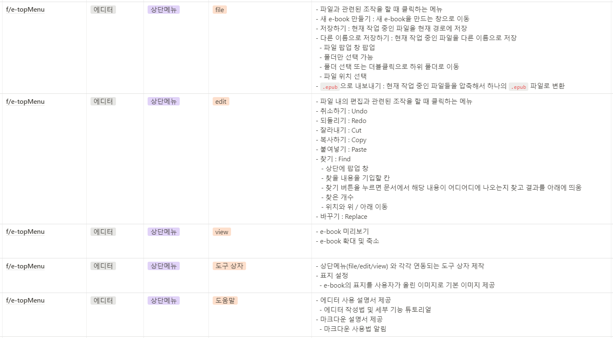
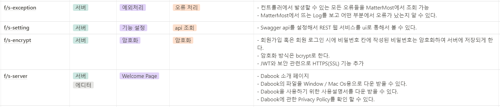

# 소독가들을 위한 다독 장려 프로젝트

## 프로젝트 개요

- 진행기간 : 2021.01.11 ~ 2021.02.19
- 만든이 : 소독가들(강세준, 강채원, 김혜민, 장주빈, 최나현, 최낙훈)
- 기획 배경 : HTML, CSS도 모르는 일반인들도 전자책을 만들수 있게 해보자.
- 목표 : GUI와 단축키로 편하게 사용가능한 Epub Editor만들기.

## Project Stack

## 기능
### 회원관리 기능
사용자 계정으로 통해 사용자의 ebook를 관리 및 다운로드가 가능합니다. 

### EPUB 파일로 변환
다른 ebook 리더기에서 읽을 수 있도록 EPUB 파일로 변환하여 저장할 수 있는 기능입니다.
( EPUB 파일이란, .epub 확장자를 가진 파일을 의미한다. .epub 파일 국제 디지털 출판 포럼에서 제장한 개방형 자유 전자서적 표준 형식을 의미합니다)

### 2가지 언어 지원 : 한글, 영어 

### 다크 모드 지원

### 동시에 편집 내용을 확인 가능

### 커스텀한 스타일태그를 사용 가능

### 우클릭을 통해 더 편한 편집 지원

## Document

    
 Convention 

    <ul>
        <a href="Document/Convention/Java_Convention.md"><li> Java Convention</li></a>
        <a href="Document/Convention/Vue(Vuex)_Convention.md"><li> Vue(Vuex) Convention</li></a>
    </ul>

    
 Commit 

    <ul>
        <a href="Document/Commit Rule/Git Commit Rule.md"><li> Git Commit Rule</li></a>
    </ul>

    
 Data Model 

    <ul>
        <a href="Document/DataModel/MongoDB Data Model(JSON).md"><li> MongoDB Data Model </li></a>
    </ul>

    
 Wire frame 

    <ul>
        <a href="Document/Wireframe/Project WireFrame Image.md"><li> Wireframe Image </li></a>
    </ul>

    
 Manual 

    <ul>
        <a href="Document/Manual/Editor_Manual(한글).html"><li> Manual(한글) </li></a>
        <a href="Document/Manual/Editor_Manual(영어).html"><li> Manual(영어) </li></a>
    </ul>

## 기능정의서

